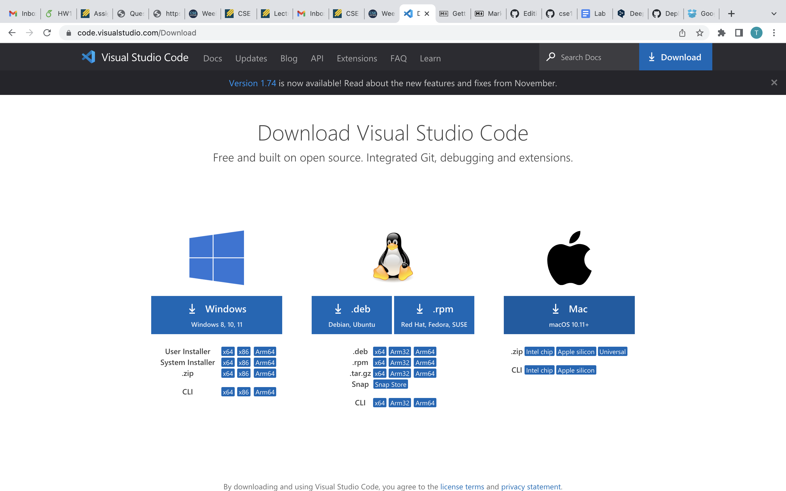
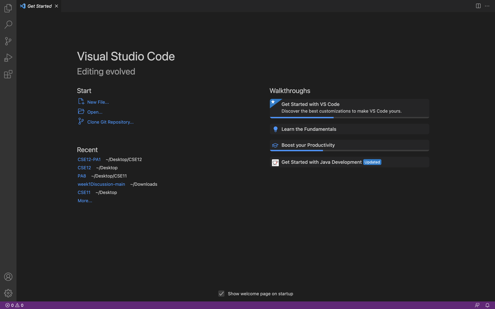
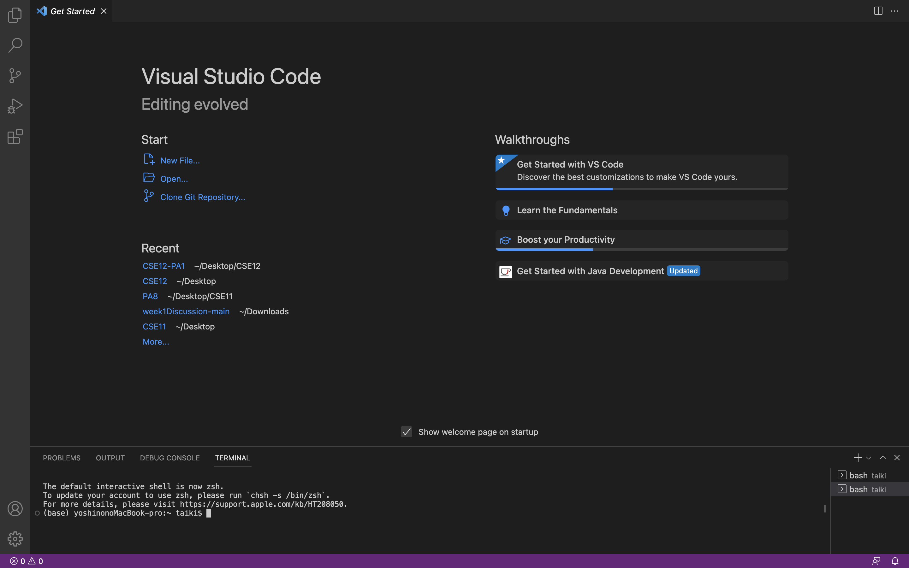

# Lab Report 1

## Installing VSCode
**#Note**  
To download the VSCode, I should go to this website and choose the competible software with my device(ex. Mac).  
(However, since I have already downloaded it in the CSE 11, I didn't need to it this time.) 

**#Note**  
After I donlowad VSCode and opend it, it took me this home page.  
(I think this page is slightly different from one I first installed.)  

## Remotely Connecting
**#Note**  
To use terminal through VSCode, I clicked "New Terminal" on the menu bar. Then, the terminal came up from the bottom up.  

## Run Some Commands

