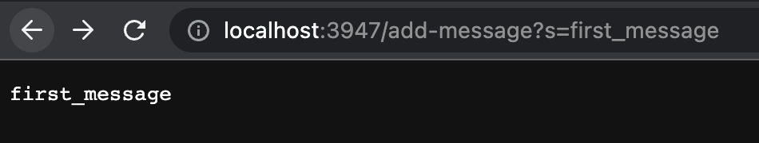
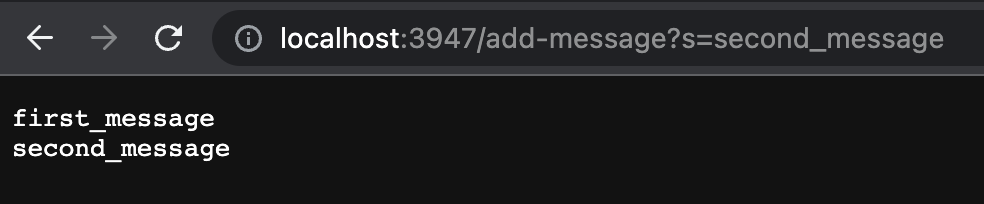
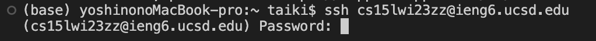
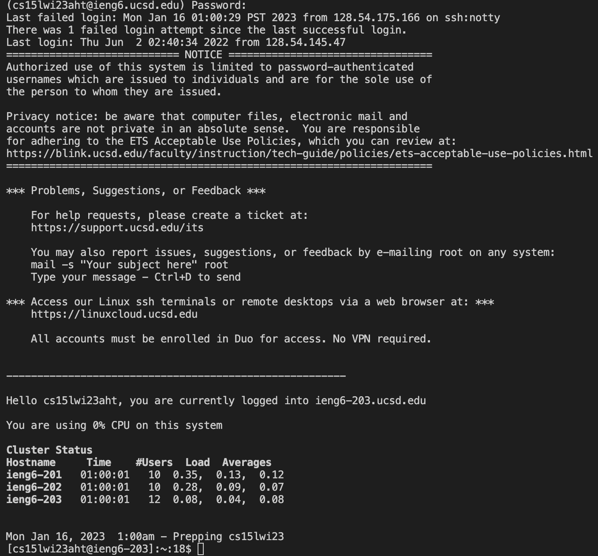

# Lab Report 2 - Servers and Bugs (Week 3)  Taiki Yoshino (A17492011)

## Part 1
**#Note**  
The web server StringServer will get a new string and desplay it in a new line. For example, as the two pictures shows, if you want to display "first_message" on the web page, you can add /add-message?s=<string> at the end of the URL, replacing <string> as "first_message". Also, you can add another message by iterating the same process or changing the message.




**#Note**  
This is the code of StringServer, which consists of two classes: StringServerHandler and StringServer.  
  
Firstly, StringServerHandler is the class to processes the information of the URL. As the default, this class returns (output= ""), and when you added /add-message?s, then the string parameters will be added to the output and it will be displayed. Note that if you add somethig rather that /add-message?s, then it will cause an error.   
  
Secondly, StringServer is the class to 
    
```
import java.io.IOException;
import java.net.URI;

class StringServerHandler implements URLHandler {
    String output = "";

    public String handleRequest(URI url) {
        if (url.getPath().equals("/")) {
            return output;
        } 
        else {
            System.out.println("Path: " + url.getPath());
            if (url.getPath().contains("/add-message")) {
                String[] parameters = url.getQuery().split("=");
                if (parameters[0].equals("s")) {
                    output += parameters[1].toString() + "\n";
                    return String.format(output);
                }
            }
            return "404 Not Found!";
        }
    }
}

class StringServer {
    public static void main(String[] args) throws IOException {
        if(args.length == 0){
            System.out.println("Missing port number! Try any number between 1024 to 49151");
            return;
        }
        int port = Integer.parseInt(args[0]);
        Server.start(port, new StringServerHandler());
    }
}
```


**#Note**  
After you download VSCode and open it, it will take you to this kind of screen.


## Part 2
**#Note**  
To use terminal in VSCode, you can click "Terminal" in the menu bar and go on to "New Terminal." Then, the terminal come up from the bottom up. (If you use Windonws devices, one more step is necessary to install git: **git bash**)  


**#Note**  
Next, you are going to use "ssh" in the command. SSH represents Secure Shell, which allow you to access a remote computer. You should type a course-specific account to log in. (I struggled with this process because I forgot to replace the "zz" with my account characters. Also, note that $ originally exists, so you have to write things after it.)  
```  
$ ssh cs15lwi23zz@ieng6.ucsd.edu
```   
After that, you will be required to enter a login password. (This password is the same as using the UCSD account.) As a note, you don't have to worry that the entered characters does not be reflected on the screen; it is because of security reasons. 



If you success in login in, this output will appear.



## Part 3
**#Note**   
Now, you can use the terminal as a client of CSE basement which is a server. These are examples to run commands at the terminal.

```  
* pwb : working directory (current directory)
* ls  : name of contents
* cat <file1> <file2>: prints contents of one or more files given by the paths.
* cd  : change directory
* cd ~: Go to home directory
* mkdir: make a new directory
```  

In the example below, I created a new directory called “taiki” using “mkdir” command and moved there using “cd.” I also went back to my home directory using “~.”  


**#Note**  
To logout the termianl, you can use either of two ways below.

```  
Ctrl-D
Run the command exit
```  
