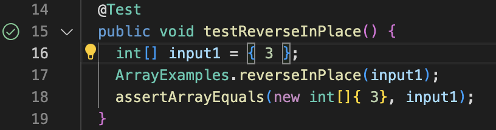
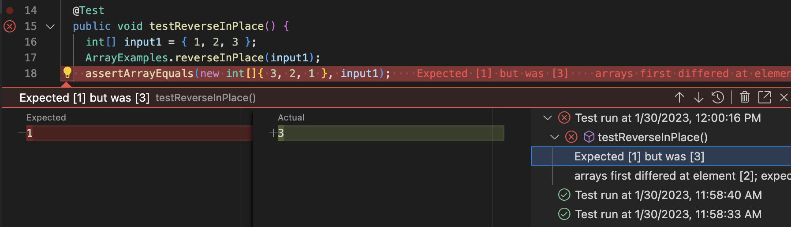

# Lab Report 3 - Researching Commands (Week 5)  Taiki Yoshino (A17492011)

## Option1: Recursive Search using ```grep -r```
**Description**  
```grep -r``` is an option to find all files that contain specified strings from the current directory and its sub-directory. The default ```grep``` command check only one specified file so you have to visit every file, but ```grep -r```allow you to search files recursively.
  
**Example1-1**  


**Example1-2** 

## Option2: Display file names which file matches specified patterns using ```grep -l``` 
**Description**  
```grep -l``` is an option to display only the file names which matches specified patterns. 

**Example2-1**  


**Example2-2** 


## Option3: Count the number of matches using ```grep -c```
**Description**  
```grep -c```is an option to count how many lines matches the given pattern/string.

**Example3-1**  


**Example3-2** 


## Option4: Display lines around the matches using ```grep -A,B,C```  
**Description**   
```grep -A,B,C```is an option to display the matching lines and also the lines before/after/around the match.

**Example4-1**  


**Example4-2** 


# Lab Report 3 - Researching Commands (Week 5)  Taiki Yoshino (A17492011)

## Option1: Recursive Search using ```grep -r```
**Description (what it’s doing and why it’s useful.)**  
```grep -r``` is an option to find all files that contain specified strings from the current directory and its sub-directory. The default ```grep``` command check only one specified file, but ```grep -r```can search recursively so you do not have to visit every file.

The StringServer gets a new string from the URL in the format ```/add-message?s=<string>```, and display it in a new line. For example, as the first picture shows, if you want to display "first_message" on the web page, you can add ```/add-message?s=<string>``` at the end of the URL and replace ```<string>``` as "first_message." Also, the second picture shows that you can add a new message below the first message by iterating the same process.


**Note**  
The StringServer file consists of two classes: StringServerHandler and StringServer. First, StringServerHandler processes the string information of a URL. As default, this class returns ```output= ""```. And, when you input new string parameters in the format ```/add-message?s=<string>```, ```handleRequest(URI uri)``` method extracts the parameter and adds it at the end of the String sequence of ```output```. Note that if you add or edit the URL in rather than format ```/add-message?s=<string>```, it will not make a any change to the output, but display the error message "404 Not Found!". Second, StringServer contains the main method and has a role in starting to sever using ```StringServerHandler``` class and a user-determined port number. Note that you must input the port number when you execute the code; otherwise, it will return the message "Missing port number! Try any number between 1024 to 49151."
    
```
import java.io.IOException;
import java.net.URI;

class StringServerHandler implements URLHandler {
    String output = "";

    public String handleRequest(URI url) {
        if (url.getPath().equals("/")) {
            return output;
        } 
        else {
            System.out.println("Path: " + url.getPath());
            if (url.getPath().contains("/add-message")) {
                String[] parameters = url.getQuery().split("=");
                if (parameters[0].equals("s")) {
                    output += parameters[1].toString() + "\n";
                    return String.format(output);
                }
            }
            return "404 Not Found!";
        }
    }
}

class StringServer {
    public static void main(String[] args) throws IOException {
        if(args.length == 0){
            System.out.println("Missing port number! Try any number between 1024 to 49151");
            return;
        }
        int port = Integer.parseInt(args[0]);
        Server.start(port, new StringServerHandler());
    }
}
```

## Option2: Count the number of matches using ```grep -c```
**Description (what it’s doing and why it’s useful.)**  
* **A failure-inducing input for the buggy program, as a JUnit test and any associated code.**
```
  @Test 
  public void testReverseInPlace() {
      int[] input1 = { 1, 2, 3 };
      ArrayExamples.reverseInPlace(input1);
      assertArrayEquals(new int[]{ 3,2,1 }, input1);
  }
```

* **An input that doesn’t induce a failure, as a JUnit test and any associated code**  
 ```
  @Test 
  public void testReverseInPlace() {
      int[] input1 = { 3 };
      ArrayExamples.reverseInPlace(input1);
      assertArrayEquals(new int[]{ 3 }, input1);
  }
``` 
* **The symptom, as the output of running the tests**         
  
  

**Note**   
When you use ```input1 = {3}``` as an input,```testReverseInPlace``` method returns ```{3}```, which alins with the expected value. On the other hand, when you use ```input1 = {1, 2, 3}``` as an input, the actual returned value is ```{3, 2, 3}```, while the expected value is ```{3, 2, 1}```.
   
   
* **The bug, as the before-and-after code change required to fix it**  

The code before changing.
```
   static void reverseInPlace(int[] arr) {
      for(int i = 0; i < arr.length; i += 1) {
        arr[i] = arr[arr.length - i - 1];
      }
   }
```  

The code after changing.	
```
  static void reverseInPlace(int[] arr) {
      for(int i = 0; i < arr.length/2; i += 1) {
          int temp = arr[i];
          arr[i] = arr[arr.length - i - 1];
          arr[arr.length - i - 1] = temp;
      }
  }
```               
   
**Note**  
This bug occurred because ```reverseInPlace``` method uses the input array ```arr``` itself in the process to reverse the sequence. For example, when the method swaps an element, the updated array ```arr``` will still be regarded as the original input array. To avoid this problem, as the code above shows, you can create a new variable ```temp``` to store the element that will be swapped, and make a change at the two indexes in the same iteration.  
	
## Option3: Display lines around the matches using ```grep -A,B,C```  
**Description (what it’s doing and why it’s useful.)**   
Before week 3 in the lab, I had used JUnit assertions to compare two strings or two integers in CSE12's programming assignments. However, I wondered how to compare double or float data types because these types of data are not determined exactly. My TA informed me that I could use the ```assertEquals(double expected, double actual, double delta)``` method to resolve this issue. The delta represents the allowable difference between the two values. If the difference between (expected - actual) is less than or equal to delta, the method returns true, otherwise it returns false. I learned that it is important to be careful when setting delta when testing floating-point numbers, as it can lead to bugs.

## Option4: Display file names which file contains specified patterns using ```grep -l``` 
**Description (what it’s doing and why it’s useful.)**  
