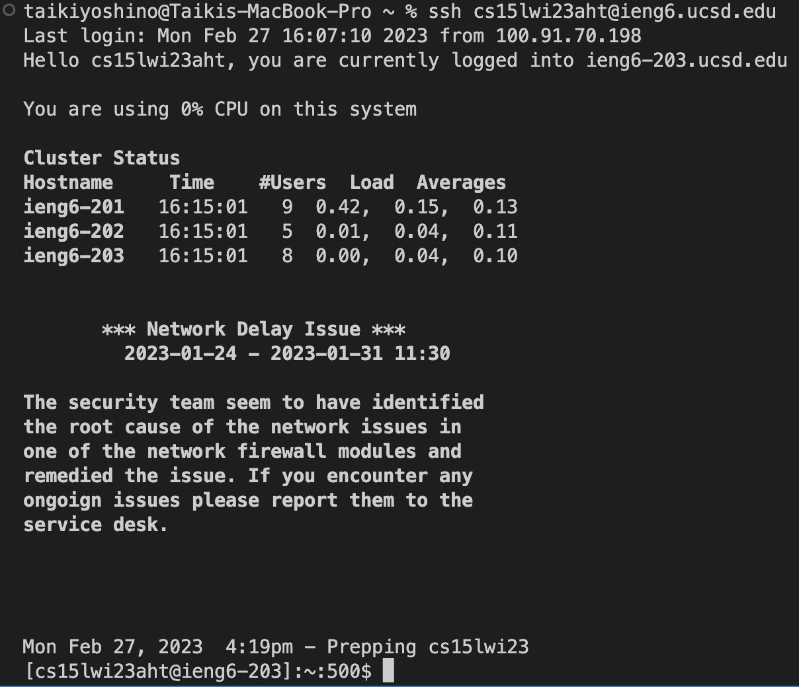
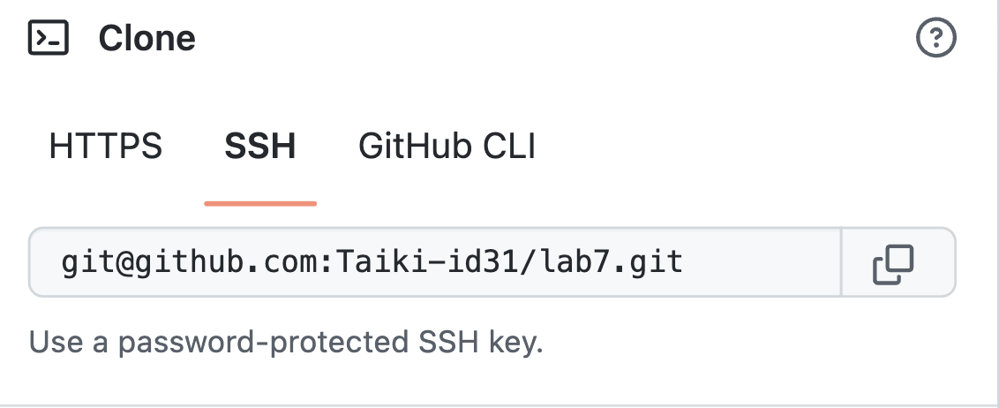
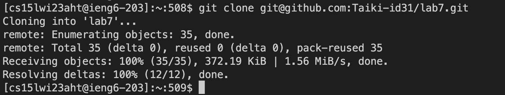
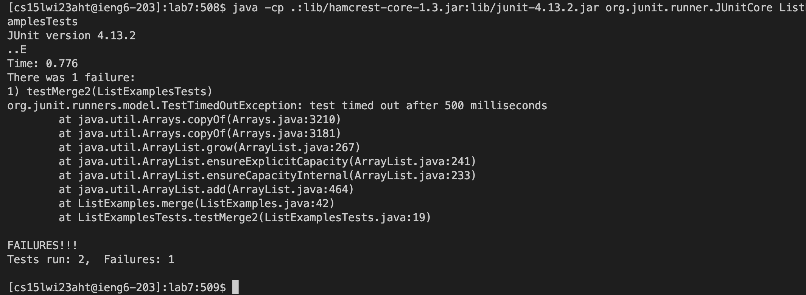
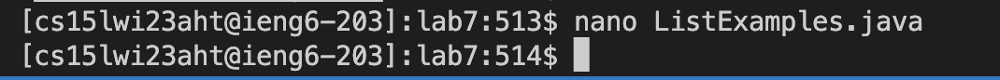
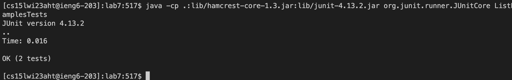
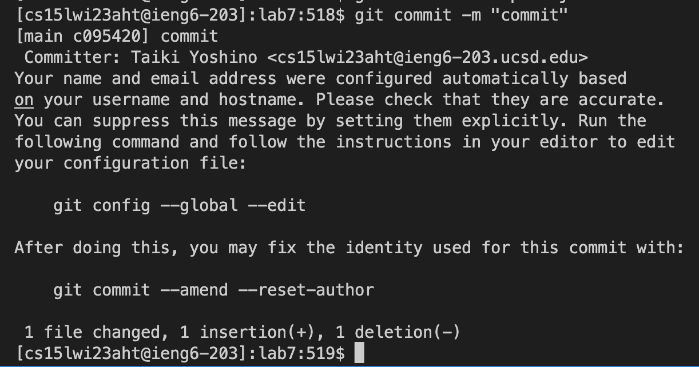
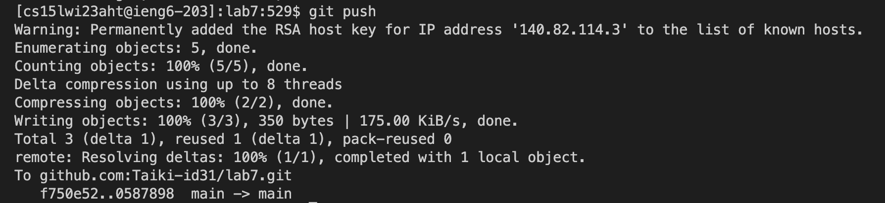

# Lab Report 4 - (Week 7)  Taiki Yoshino (A17492011)

## Step4: Log into ieng6   
Entered command   
```$ssh <Ctrl-R> c <Return>``` 

Executed Command  
```$ssh cs15lwi23aht@ieng6.ucsd.edu``` 

Note:  
```<Ctrl-R>``` enables to access command history. Since I have typed ```$ssh cs15lwi23aht@ieng6.ucsd.edu``` several times, ```<Ctrl-R> c``` can automatically convert it into ```cs15lwi23aht@ieng6.ucsd.edu```.



## Step5: Clone your fork of the repository from your Github account 
Entered command   
```$git clone <Command-V> ``` 

Executed Command  
```$git clone git@github.com:Taiki-id31/lab7.git```

Note:  
I first go to the GitHub page of the forked file and copy the ssh key. Afterward, go back to the terminal and type ```$git clone ``` and the copied ssh-key using ```<Command-V>```. 

 


## Step6: Run the tests, demonstrating that they fail
Entered & Executed command   
```$cd lab7 ``` 

Note:  
Since the lab file is cloned in the home directory, I have to move to lab7 using cd command. 

Entered command    
```$<Ctrl-R> javac <Return> ``` 

Executed Command      
```$javac -cp .:lib/hamcrest-core-1.3.jar:lib/junit-4.13.2.jar *.java```

Entered command      
```$<Ctrl-R> java <up> <up> <Return> ``` 

Executed Command     
```$java -cp .:lib/hamcrest-core-1.3.jar:lib/junit-4.13.2.jar org.junit.runner.JUnitCore ListExamplesTests```

Note:  
The two commands above conduct compiling and executing the files. In both commands, I used ```$<Ctrl-R>``` to search the command from the history. The second command was two up in the history, so I used up arrow key twice.

 

## Step7: Edit the code file to fix the failing test
Entered and Executed command   
```$nano  ListExamples.java```    

Note:   
I can use nano command to open and edit the specified file. Since the error in step6 is caused by ListExamples.java, I specified the file. As the image below shows, the bug is due to the index2 is not correctly updated, so I rewrite the index1 into index2. 


```<down> (× 42-times) <Rgiht> (× 12-times) <Delete> 1```    
```<Ctrl-O> <Return> <Ctrl-X>```   

  

   

Note:    
After editing the file, I can save the change using ```<Ctrl-O> ``` and exit the editing screen using ```<Ctrl-X>```.

## Step8: Run the tests, demonstrating that they now succeed
Entered command  
```$<Ctrl-R> javac <Return>``` 

Executed Command       
```$javac -cp .:lib/hamcrest-core-1.3.jar:lib/junit-4.13.2.jar *.java```

Entered command  
```$<Ctrl-R> java <up><up><up><up><up><up><up><up><Return>``` 

Executed Command    
```$java -cp .:lib/hamcrest-core-1.3.jar:lib/junit-4.13.2.jar org.junit.runner.JUnitCore ListExamplesTests```

Note:   
I recompiled the file and executed it again using the same commands I used. As the below picture shows, the problem was resolved. The second command was eight up in the history, so I used up arrow key eight times. 

   

## Step9: Commit and push the resulting change to your Github account (you can pick any commit message!)
Entered command  
```$git add <tab> <Ctrl-V> <return>```   

Executed Command   
```$git add ListExamples.java ```   

Note:   
I am going to commit and push the changes to git. To begin with, I have to specify which file I edited using ```$git add``` command and copy and paste the file name of ListExamples.java using ```<tab>``` and ```<Ctrl-V>```.

Entered and Executed command   
```$git commit -m "commit"```      

Note:   
I have to use the commit command with some message. This time, I used "commit" as a message.

  

Entered and Executed command    
```$git push```  

Finally, I can push the changes to the github using push command. 

  
