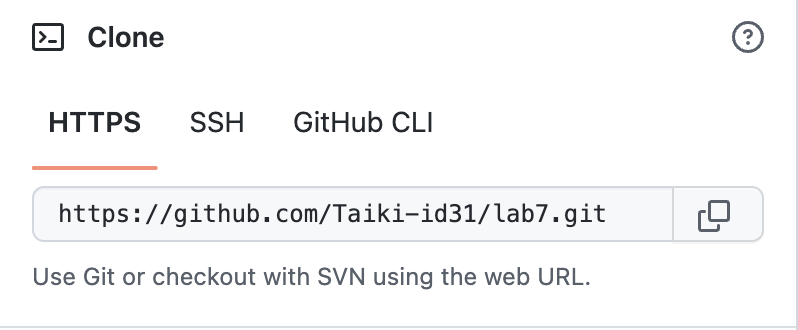

# Lab Report 4 - (Week 7)  Taiki Yoshino (A17492011)

## Step4: Log into ieng6   
Entered command   
```$ssh <Ctrl-R> c <Return>``` 

Executed Command  
```$ssh cs15lwi23aht@ieng6.ucsd.edu``` 


## Step5: Clone your fork of the repository from your Github account 
Entered command   
```$git clone <Command-V> ``` 

Executed Command  
```$git clone https://github.com/Taiki-id31/lab7.git```


 


## Step6: Run the tests, demonstrating that they fail
Entered & Executed command   
```$cd lab7 ``` 

Entered command    
```$<Ctrl-R> javac <Return> ``` 

Executed Command      
```$javac -cp .:lib/hamcrest-core-1.3.jar:lib/junit-4.13.2.jar *.java```


Entered command      
```$<Ctrl-R> java <up> <up> <Return> ``` 

Executed Command     
```$java -cp .:lib/hamcrest-core-1.3.jar:lib/junit-4.13.2.jar org.junit.runner.JUnitCore ListExamplesTests```

 

## Step7: Edit the code file to fix the failing test
Entered and Executed command   
```$nano  ListExamples.java```    
  

Edit the file.   
  

```<Ctrl-O> <Return> <Ctrl-X>``` 

## Step8: Run the tests, demonstrating that they now succeed
Entered command  
```$<Ctrl-R> javac <Return>``` 

Executed Command       
```$javac -cp .:lib/hamcrest-core-1.3.jar:lib/junit-4.13.2.jar *.java```

Entered command  
```$<Ctrl-R> java <up><up><up><up><up><up><up><up><Return>``` 

Executed Command    
```$java -cp .:lib/hamcrest-core-1.3.jar:lib/junit-4.13.2.jar org.junit.runner.JUnitCore ListExamplesTests```

   

## Step9: Commit and push the resulting change to your Github account (you can pick any commit message!)
Entered command  
```$git add <tab> <Ctrl-V> <return>```   

Executed Command   
```$git add ListExamples.java ```

Entered and Executed command   
```$git commit -m "commit"```     

  

Entered and Executed command    
```$git push``` 

  
