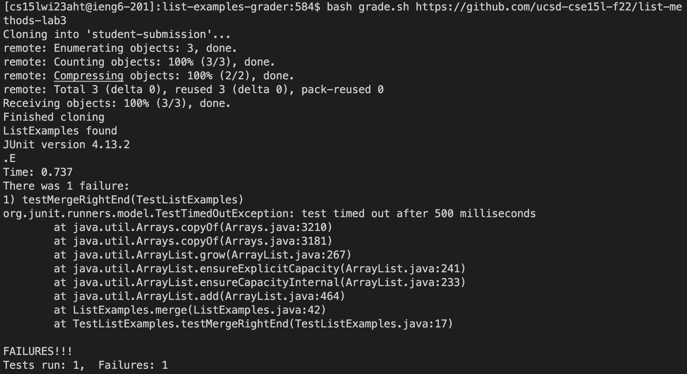
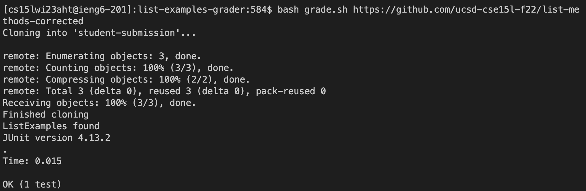
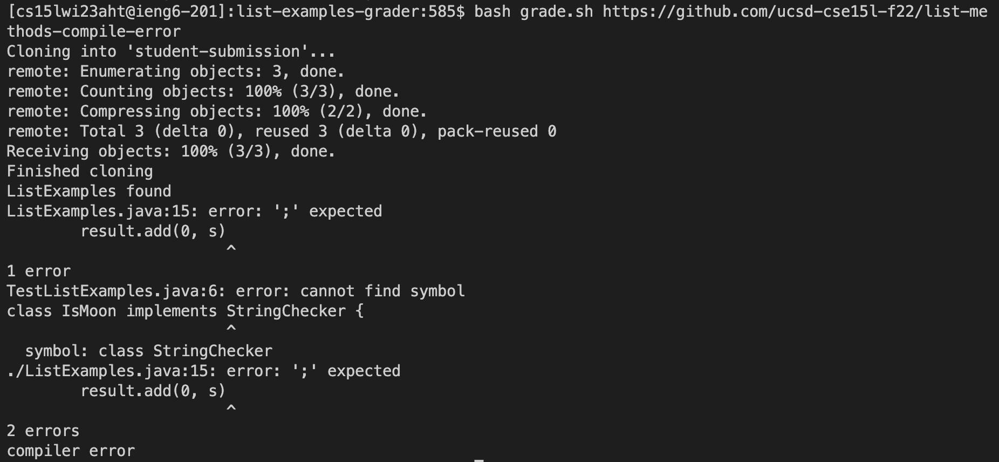
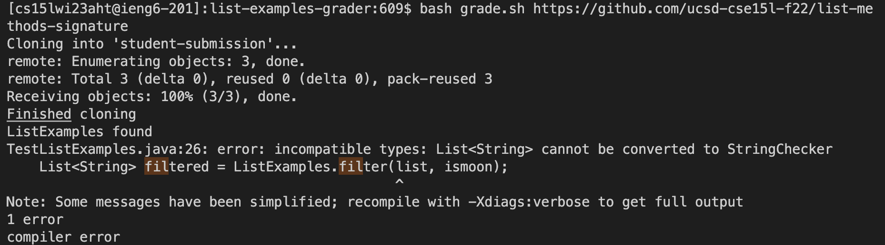

# Lab Report 5 - (Week 10)  Taiki Yoshino (A17492011)

## Bash Script in "grade.sh"  
```
CPATH='.:lib/hamcrest-core-1.3.jar:lib/junit-4.13.2.jar'

rm -rf student-submission
git clone $1 student-submission
echo 'Finished cloning'

cd student-submission
if [[ -f ListExamples.java ]]
then
    echo "ListExamples found"
else
    echo "ListExamples not found"
    exit 1
fi
mkdir lib
cp ../lib/hamcrest-core-1.3.jar ./lib/
cp ../lib/junit-4.13.2.jar ./lib/
cp ../TestListExamples.java ./

javac ListExamples.java

javac -cp $CPATH  TestListExamples.java

if [[ $? -ne 0 ]]
then
    echo "compiler error"
    exit 2
fi

java -cp $CPATH  org.junit.runner.JUnitCore TestListExamples
``` 

## Test1: The same code as the starter from lab3
https://github.com/ucsd-cse15l-f22/list-methods-lab3

Entered command   
```$bash grade.sh https://github.com/ucsd-cse15l-f22/list-methods-lab3``` 

Note:  
I first go to the GitHub page of the forked file and copy the ssh key. Afterward, go back to the terminal and type ```$git clone ``` and the copied ssh-key using ```<Command-V>```. 

Output  
 

## Test2: Correct methods (I would expect this to get full or near-to-full credit)
https://github.com/ucsd-cse15l-f22/list-methods-corrected

Entered & Executed command   
```$bash grade.sh https://github.com/ucsd-cse15l-f22/list-methods-corrected``` 

Note:  
Since the lab file is cloned in the home directory, I have to move to lab7 using cd command. 

 

## Test3: Method including syntax error of a missing semicolon
https://github.com/ucsd-cse15l-f22/list-methods-compile-error

Entered & Executed command   
```$bash grade.sh https://github.com/ucsd-cse15l-f22/list-methods-compile-error```     

Note:   
I can use nano command to open and edit the specified file. Since the error in step6 is caused by ListExamples.java, I specified the file. As the image below shows, the bug is due to the index2 is not correctly updated, so I rewrite the index1 into index2 using the following commands.  

   

## Test4: The arguments of filter in the wrong order
https://github.com/ucsd-cse15l-f22/list-methods-signature

Entered & Executed command   
```$bash grade.sh https://github.com/ucsd-cse15l-f22/list-methods-signature```     

Note:   
I can use nano command to open and edit the specified file. Since the error in step6 is caused by ListExamples.java, I specified the file. As the image below shows, the bug is due to the index2 is not correctly updated, so I rewrite the index1 into index2 using the following commands.  

  
